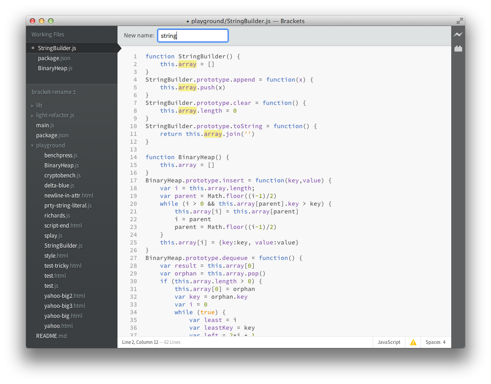
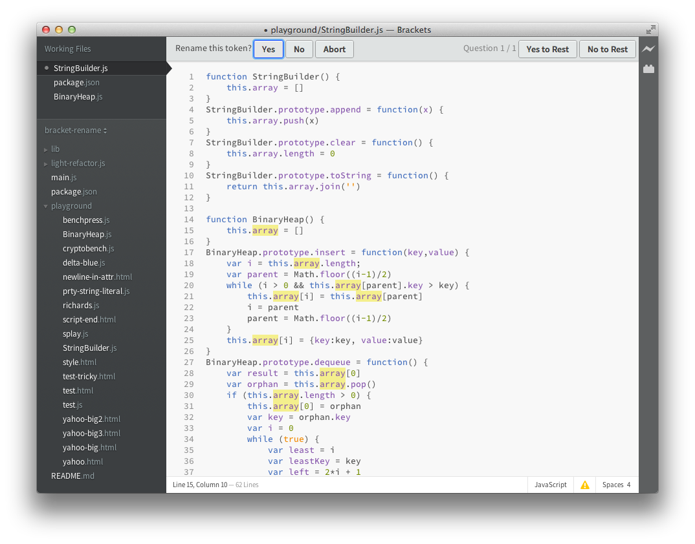

# Bracket-Rename

Rename JavaScript Identifier for [Brackets](http://brackets.io/).

### Installation
Install [Brackets](http://brackets.io/) and then use the URL to this github page in the extension manager.

### Usage
Place the cursor on a JavaScript identifier and press *Ctrl-R* to rename it.

### Status
Working prototype.

# Change Log

#### 0.2.6 May 4, 2014
- Command moved to the new Find menu in Sprint 39.

#### 0.2.5 December 24, 2013
- Fixed handling of [arrays with omitted elements](https://github.com/asgerf/light-refactor.js/pull/2).

#### 0.2.4 December 8, 2013
- Compatibility with API changes to ModalBar in Sprint 35.

#### 0.2.3 October 17, 2013
- Fix for new version of Brackets (Sprint 32). The API for ModalBar had changed and was not backward compatible.

#### 0.2.1 July 7, 2013
- More conservative treatment of arrays. (Removed @prty-of rule)

#### 0.2.0 June 23, 2013
- Support for HTML files

#### 0.1.1 June 21, 2013
- Bugfix

#### 0.1.0 June 17, 2013
- Initial release
